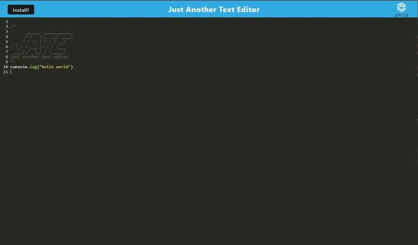
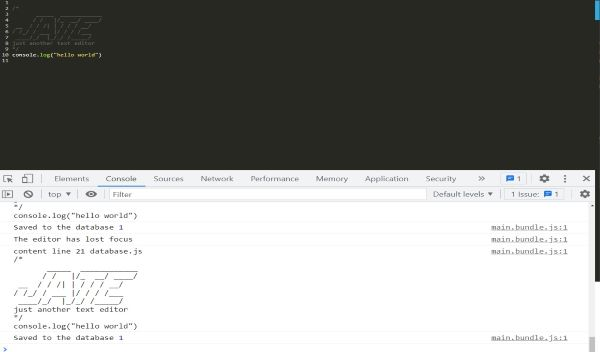
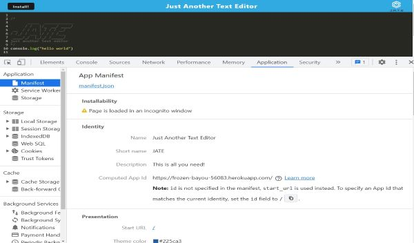
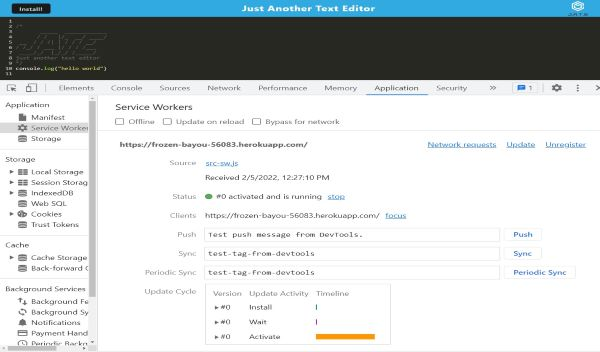

# Text Editor

### Just Another Text Editor
Just Another Text Editor (JATE) is a Progressive Web App (PWA) compliant text editor that runs in the browser.  This is a single-page application and features a number of data persistence techniques that serve as redundancy in case one of the options is not supported by the browser.  This application functions offline as well.
***

## Table of Contents
* [Description](#description)
* [Deployment](#deployment)
* [Usage](#usage)
* [Technologies](#technologies)
* [Contact](#contact)
* [Repository](#repository)

### Description
The user can write code using the text editor that can function offline.  If they desire, they can install the text editor which builds a shortcut onto a local system's desktop. The user can then run JATE on a local system upon install.

## Deployment
This application has been deployed at Heroku. [It can be located here.](https://frozen-bayou-56083.herokuapp.com/)

## Usage
The following images demonstrate the application in use.

## Contact
If you have any questions about this project or would like to report and issue, please email Dan Golden and golden.daniel@gmail.com

## Repository
https://github.com/DanPGolden/text_editor